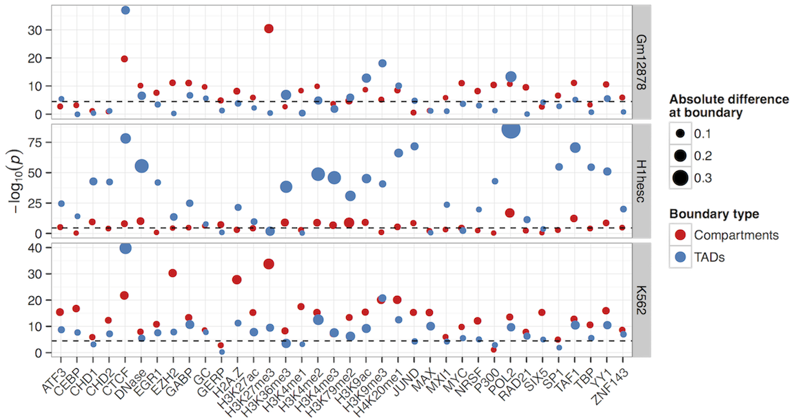
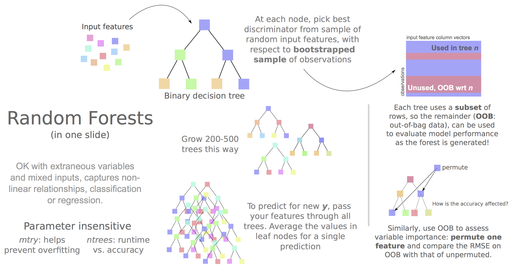

<!-- Limit image width and height -->
<style type='text/css'>
img {
    max-height: 540px;
    max-width: 964px;
}
body {
  /* margin-top: 40px; */
}
ol.linenums {
  margin-left: 0px;
}
#features p {
  font-size: 14px;
  line-height: 21px;
  color: #777777;
}
#solo p {
  text-align:center;
  font-size:xx-large;
  /* font-weight:bolder; */
  margin-top:25%;
  color:#777777;
}

.title-slide {
  background-color: #FEFEFE;
}

h1 {
  color: #DDDDDD;
}

.hicslide {
  background-image: url(figure/bghic3.png);
}

#bigwriting {
  font-size:x-large;
}

</style>

<!-- Center image on slide -->
<script src="http://ajax.aspnetcdn.com/ajax/jQuery/jquery-1.7.min.js"></script>
<script type='text/javascript'>
$(function() {
    $("p:has(img)").addClass('centered');
});
</script>
 
## Overview

<br />

* Introduce higher order chromatin structure and the <b>Hi-C</b> technique

* Describe our work integrating Hi-C with new <b>ENCODE</b> datasets

* Highlight some of the <b>results</b> from the first two years of my PhD

--- #solo 

What's higher order chromatin structure?

--- bg:black

## Looks something like this:


<br />
Lieberman Aiden et al. (2009)

---

## Or a bit more clearly:


<br />
Steensel and Dekker (2010)


--- 

## Hi-C


<br />
Belton et al. (2012)

--- .hicslide

<h2 style="color:white">The results</h2>

--- 

## Statistical corrections


<p style="text-align: left; font-size: .8rem">
Figure from Yaffe and Tanay (2011)
</p>

--- #solo 

Insights from Hi-C data

---

## Multi-megabase chromosome compartments

<br />


<p style="text-align: left; font-size: .8rem">
Left figure from Lieberman-Aiden <em>et al.</em> (2009)
</p>

--- &colscust

## Sub-megabase topological domains

*** =left


<p style="text-align: left; font-size: .8rem">
Figure from Dixon <em>et al.</em> (2012)
</p>


*** =right

<div style="margin-top:20%; float:right; width:100%">
<p style="text-align:center;">
Higher resolution structures called 
<br />
"Topological associating domains"
<br />
<p style="font-size:xx-large; text-align:center"><b>TADs</b></p>
</p>
<br />
<p style="text-align:left; margin-left:10%">

~800 kb in size (compartments ~5 Mb)

<br /><br />

Identified using directional contact bias

<br /><br />

Highlighted regions as TAD boundaries

</p>
</div>

---

## TAD boundaries


<p style="text-align: left; font-size: .8rem">
Figure from Dixon <em>et al.</em> (2012)
</p>

--- #solo 

Our results


---

## Plan

<br />

1. Get raw Hi-C reads (three pulications for different human cell lines)

2. Uniformly process interaction matrices and normalise with ICE (Imakaev et al., 2012)

3. Call compartments, TADs, boundaries — compare these across cell types

4. Investigate relationship with ENCODE ChIP-seq data: uniformly-processed signal (fold-change relative to input, from Boyle et al., 2014)

<br />

--- 

### Higher order structure highly conserved genome-wide


--- bg:#DFDFDF

### ...and at multiple levels of higher-order chromatin structure.

<br />


--- 

### Regions in which chromatin structure varies between cell types


--- &colscust

### Overall, flipped regions are enriched for tissue-specific enhancers

*** =left

<div style="margin: 20% 4%">

<p>
<code>ChromHMM</code> + <code>SegWay</code> consensus chromatin state predictions from ENCODE
</p>
<p>
Split into <b>cell-type specific</b> and <b>shared</b> (overlapping annotation in &ge; 2 cell types)
</p>
<br />
<p>
Enrichment for cell-type specific enhancers in <u>flipped open</u> regions in the two lineage-committed cell lines
</p>
</div>


*** =right

<br />


---

### Boundary enrichments at different scales


<br />

<p style="text-align: center;">
Boundary profiles have previously been looked at for a handful of features, <br />
we can do this with lots more and test their significance
</p>

---

### CTCF and YY1 consistently mark both TAD and compartment boundaries



---

<p style="text-align:center; font-size:x-large; margin-top:15%; color:#777777">
Can compartments be predicted from ENCODE ChIP-seq data? 
</p>

<p style="text-align:left; margin-left: 20%; margin-top: 10%;">And if so:<br /> 

&nbsp;&nbsp;&bullet; What are the most informative variables <br />

&nbsp;&nbsp;&bullet; Do rules differ between cell types <br />

&nbsp;&nbsp;&bullet;  Can we call compartments when Hi-C data isn't available <br />

</p>

---

<br />



---

### Decent modeling accuracy, a variety of informative features


---

### But input features suffer from multicollinearity


--- &colscust

### Allowing models to cross-apply between cell types

*** =left


*** =right

<p style="margin-top:25%; margin-left:5%; margin-right:5%">
H1 embryonic stem cells looks like an <b>outlier</b>&hellip; <br /><br />
&nbsp;&nbsp;&hellip;generally open, more permissive genome organisation than
the lineage-commited lines.
</p>

---

## Summary

<br />

* Open / closed compartments well-correlated with combinatorial patterns of histone mods + DNA binding proteins, enabling <b>accurate predictive models</b>

* Cross-application shows <b>common structural rules</b> across human cell types

* Still, variable importances reflect known biology (EGR1 in stem cells, H3k9me3 in K562)

* <b>CTCF and YY1</b> may combine to create organisational boundaries at multiple scales

* Cell-type specific <b>enhancers</b> likely responsible for local changes in chromatin architecture


---

<p style="text-align:center; font-size:xx-large; margin-top:20%">
Thanks for your attention
</p>
<br />
<p style="font-size:smaller; text-align:center">
Supervisors: Colin Semple and Stuart Aitken</div>
</p>


<div style="float:left; margin-top:18%">
<p style="font-size:small">References:</p>
<p style="font-size:x-small">
  Belton et al. (2012) Hi-C: a comprehensive technique to capture the conformation of genomes. <strong>Methods</strong>, 58, 268-76.
<br />
  Boyle et al. (2014) Comparative analysis of regulatory information and circuits across distant species. <strong>Nature</strong>, 512, 435-6.
<br />
  Dixon et al. (2012) Topological domains in mammalian genomes identified by analysis of chromatin interactions. <strong>Nature</strong>, 485, 376-80.
<br />
  Imakaev et al. (2012) Iterative correction of Hi-C data reveals hallmarks of chromosome organization. <strong>Nature methods</strong>, 9, 999-1003.
<br />
  Kalhor et al. (2011) Genome architectures revealed by tethered chromosome conformation capture and population-based modeling. <strong>Nature biotechnology</strong>, 30, 90-8.
<br />
  Lieberman Aiden et al. (2009) Comprehensive Mapping of Long-Range Interactions Reveals Folding Principles of the Human Genome. <strong>Science</strong>, 326, 289-93.
<br />
  Yaffe and Tanay (2011) Probabilistic modeling of Hi-C contact maps eliminates systematic biases to characterize global chromosomal architecture. <strong>Nature genetics</strong>, 43, 1059-65.

</p>
</div>

<div style="float:left; margin-top:1%"> <p style="font-size:small">HTML5 presentation written in <code>RMarkdown</code> using <code>library("slidify")</code>.</p></div>

```{r eval=F, echo=F}
library("slidify")
library("slidifyLibraries")
slidify("~/Presentations/SectionTalk_Sept16_2014/index.Rmd")
```
