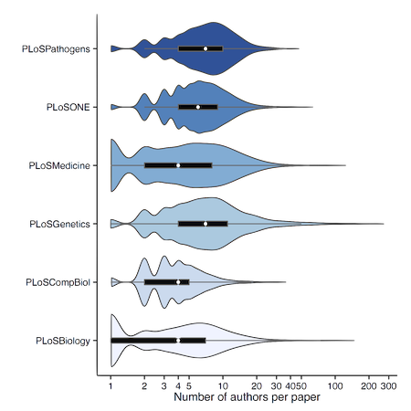
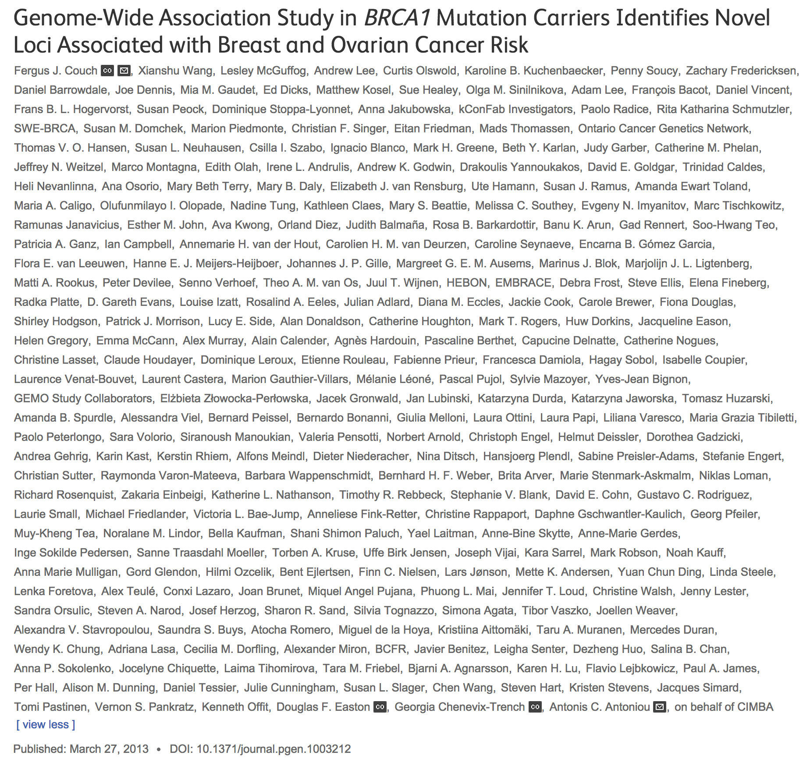
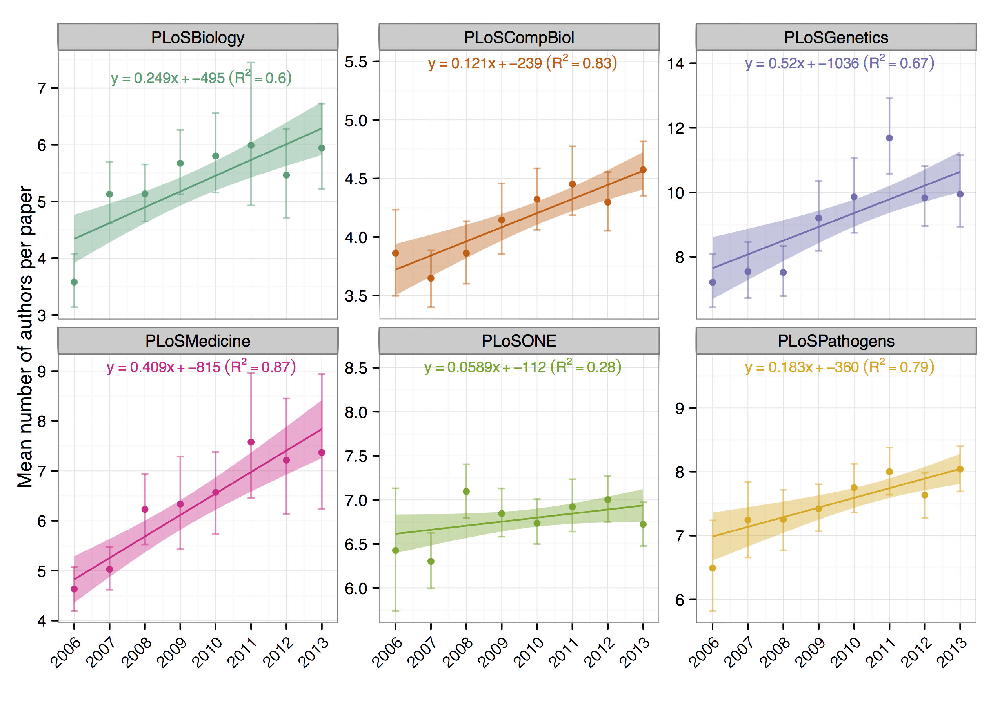
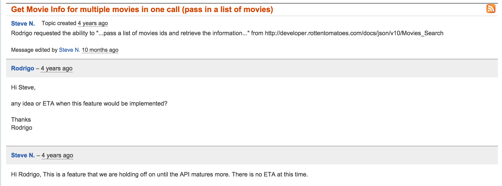
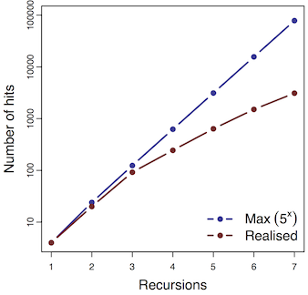
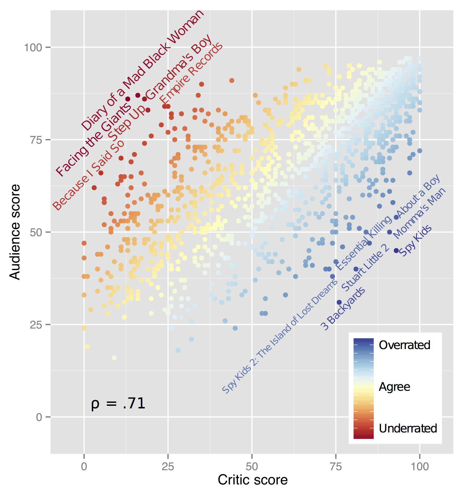
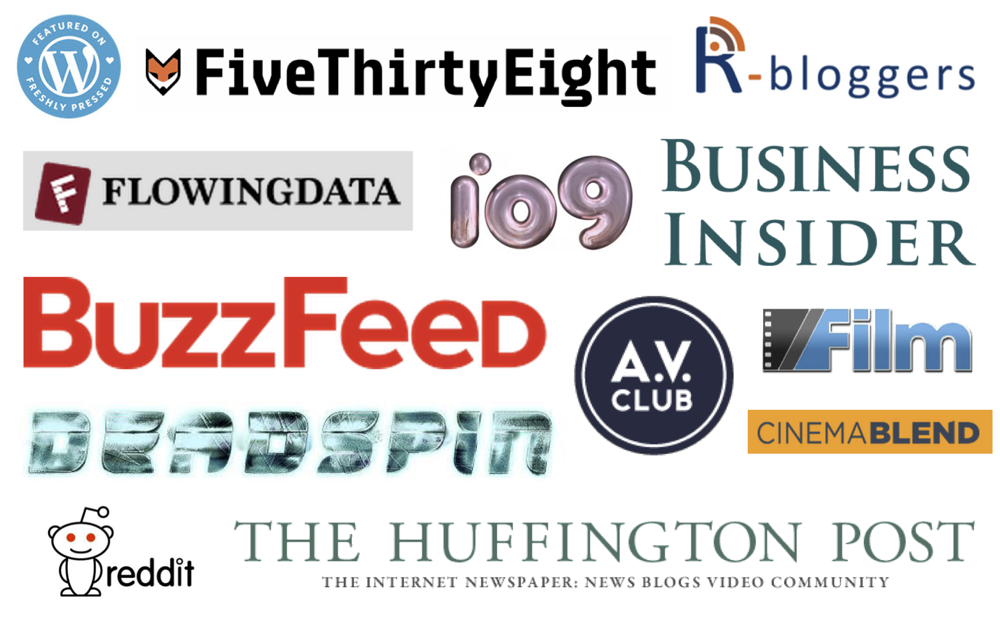

<!-- Limit image width and height -->
<style type='text/css'>

.rChart {
    display: block;
    margin-left: auto;
    margin-right: auto;
    width: 500px;
    height: 500px !important;
}

img {
    max-height: 540px;
    max-width: 964px;
}
body {
  /* margin-top: 40px; */
}
ol.linenums {
  margin-left: 0px;
}
#features p {
  font-size: 14px;
  line-height: 21px;
  color: #777777;
}
#solo p {
  text-align:center;
  font-size:xx-large;
  /* font-weight:bolder; */
  margin-top:25%;
  color:#777777;
}

.title-slide {
  background-color: #FEFEFE;
}

#bigwriting {
  font-size:x-large;
}

</style>

<link href="assets/css/font-awesome.min.css" rel="stylesheet">

<!-- Center image on slide -->
<script src="http://ajax.aspnetcdn.com/ajax/jQuery/jquery-1.7.min.js"></script>
<script src='http://d3js.org/d3.v3.min.js' type='text/javascript'></script>
<!-- <script src='http://dimplejs.org/dist/dimple.v2.1.0.min.js' type='text/javascript'></script> -->

<script type='text/javascript'>
$(function() {
    $("p:has(img)").addClass('centered');
});
</script>

## I'm going to talk about...

<br />

A couple of examples of R analyses I've done for fun:

&nbsp;&nbsp;1. Author inflation

&nbsp;&nbsp;2. Overrated films

<br />

But also:

* Creating interactive plots from R with rCharts

* HTML5/CSS3/JS presentations from RMarkdown with Slidify

<aside class="note">
<section>
<p>
First is somewhat academia related, then a pop culture one.

These also lead in to talking about two great R packages that
are helping bring R to the web.
</p>
</section>
</aside>

--- #solo 

Example 1: Author inflation

--- bg:black

<article class="flexbox vcenter">

</article>

<aside class="note">
<section>
<p>
Found this question on academia stackexchange, lots of votes and discussion.
Talks about the idea of a "golden age" of scientific publishing, where single
authors dominated. Nice image.
</p>
</section>
</aside>

---

## Starting point

<ul class="build fade">

<li> Interesting question </li>

<li> No real answers, speculation </li>

<li> Easy to test!!</li>

</ul>

<aside class="note">
<section>
<p>
Good starting point for some analysis. Interesting question,
one that I'd actually be interested in answering.  (*) The other answers were just
speculation or anecdotal (With a couple of very specific examples, like
a specific field of taxonomy). (*) Best of all:: very easy to test! Lots of ways to 
get citation data, and counting authors should be easy.
</p>
</section>
</aside>

--- 

## Getting some data

<br />


<div style="width: 50%; margin-left: auto; margin-right: auto; margin-top: 10%" class="fragment">

</div>

<aside class="note">
<section>
<p>
ROpenSci community of package builders looking to open up science.
Provide lots of handy APIs, in this case the one I was used is for PLOS
journals. (rplos) No particular reason other than nice API and R package.
</p>
</section>
</aside>

---

## Code

```{r eval=F}

searchplos(
  # Query: publication date in 2012
  q  = 'publication_date:[2012-01-01T00:00:00Z TO 2012-12-31T23:59:59Z]', 
 
  # Fields to return: id (doi) and author list
  fl = "id,author", 
 
  # Filter: only actual articles in journal PLOS ONE
  fq = list("doc_type:full",
            "cross_published_journal_key:PLoSONE"), 
 
  # 500 results (max 1000 per query)
  start=0, limit=500, sleep=6)
  
```

<aside class="note">
<section>
<p>
Example query, intuitive way to request records.

Package handles API rate limits (sleep)


Downside: unwieldy date time specification...
</p>
</section>
</aside>

---

## Author count distributions

<br />



<aside class="note">
<section>
<p>
Bean plots showing author densities over entire PLOS collection.
With overlaid boxplots showing summary stats for comparison.
</p>
<p>
This is an old plot: Should really be ordered by (e.g.) median, 
never order alphabetically.
</p>
<p>
We can see plos comp biol appears to have the lowest number of authors
while Genetics potentially has the most. Also one extreme outlier:
</p>
</section>
</aside>

--- bg:black

## 270 authors...



<aside class="note">
<section>
<p>
Was this BRCA1 paper with 270 authors.
</p>
<p>
Nothing on the 3,000 author ATLAS paper but still quite a few.
</p>
</section>
</aside>

---

## Evidence for author inflation



<aside class="note">
<section>
<p>
Back to the original question: are author lists getting longer?

<b>Yes</b>, even in this short timescale of 7 years you can see 
good evidence for author inflation, with journals like PLOS Genetics
adding around <b>half an extra author per year</b>, on averge. Seemed 
surprisingly high to me.
</p>
<p>
Bootstrapped confidence limits on mean, varying sample sizes (e.g.
PLOS ONE 30k articles, pathogens maybe 3k)
</p>
</section>
</aside>

--- &leftcol

## High impact == high inflation ?

*** =left


*** =right

<br />

<u>TODO</u>

> * expand to entire NLM Medline / Pubmed records (>22 mill)

> * Try to get at "good inflation vs. bad inflation"

>   * Relative growth of acknowledgements? (PMC)

>   * Inflation decrease when "author contributions" brought in?

<aside class="note">
<section>
<p>
Also interesting to try an "understand" these results a little,
so here I'm comparing the extimate of author inflation with the
journals "Impact Factor", and there seems to be an OK correlation
(can't claim statistical significance with these 6 points).
</p>
<p>
I would like to return to this at some point with the whole of pubmed,
22 million records dating from 1809 so maybe we can see this single author period
transitioning to larger collaborations of today.
</p>
<p>
Good to get at Good V Bad, maybe via acknolwedgments? Did author inflation
decrease when journals introduced policies where you have to explicitly state
who did what?
</p>
</section>
</aside>

--- #solo 

Example 2: Overrated movies

<aside class="note">
<section>
<p>
Second example totally different: <b>pop culture</b>
</p>
</section>
</aside>

---

## Starting point

<br />

* Everyone relates to concept of "over/underrated" — but it's inherently subjective

* Maybe a way to quantify this (with, e.g. films) could be:

<br />

> * <b>Critic ratings</b> — subjective ratings

> * <b>Audience ratings</b> — "objective truth" (crowd-sourced, many wrongs principle)

>   * (Wrong way round? Up to you... ) <br /><br />

> * So given this definition of "overrated": <br /><p style="font-size: 1.3em; text-align: center;"><b>Q:</b> What are the most (over|under)rated films?</p>

<aside class="note">
<section>
<p>
Critics are the people doing the overrating and underratings
</p>
<p>
Some people said obviously other way round, critics are right and
together get their ratings about right, it's the audience that's off — 
both fine, just mentally swap the words. Important thing is to state it up front.
</p>
</section>
</aside>

--- 


They have a REST API! 

```{r eval=F}

library("RCurl")
library("jsonlite")

api.key <- "somelongAPIkey"
rt <- getURI(paste0("http://api.rottentomatoes.com/api/public/v1.0/",
                    "lists/dvds/top_rentals.json?apikey=", api.key, "&limit=50"))

rt <- fromJSON(rt)

title <- rt$movies$title
critics <- rt$movies$ratings$critics_score
audience <- rt$movies$ratings$audience_score
```

<aside class="note">
<section>
<p>
REST: representational state transfer: uniform output, e.g. JSON
Stateless requests, same req, same output

Architectural style, not protocol like SOAP
</p>
</section>
</aside>

--- 

<p style="font-color: #ffa775; font-size: 1.4em; text-align: center;">This is easy, why hasn't someone done it before...</p>

<br />



<br />

<div style="text-align: center;"><h2>!!!</h2></div>

--- 

## Hacky solution

<br />

> 1. Get largest starting list of films possible (Top rentals: <b>50</b>)

> 2. For each, retrieve "similar films" (max: <b>5</b>!)

> 3. Unique-ify and recurse, growing film list exponentially...

--- &rightcol

## "Walled gardens"

*** =left

<br />

<br />



*** =right

<br />


---

## Results v1



---

## Most underrated

<table border="1" style="font-size:.6em"><tbody><tr><th><br></th> <th>Title</th> <th>Critics</th> <th>Audience</th> <th>Difference</th> </tr><tr><td align="right">1</td><td><a href="http://www.rottentomatoes.com/m/facing_the_giants/" target="_blank">Facing the Giants</a></td><td align="right">13</td><td align="right">86</td><td align="right">-73</td></tr><tr><td align="right">2</td><td><a href="http://www.rottentomatoes.com/m/boondock_saints/" target="_blank">The Boondock Saints</a></td><td align="right">20</td><td align="right">92</td><td align="right">-72</td></tr><tr><td align="right">3</td><td><a href="http://www.rottentomatoes.com/m/diary_of_a_mad_black_woman/" target="_blank">Diary of a Mad Black Woman</a></td><td align="right">16</td><td align="right">87</td><td align="right">-71</td></tr><tr><td align="right">4</td><td><a href="http://www.rottentomatoes.com/m/grandmas_boy/" target="_blank">Grandma's Boy</a></td><td align="right">18</td><td align="right">86</td><td align="right">-68</td></tr><tr><td align="right">=5</td><td><a href="http://www.rottentomatoes.com/m/step_up/" target="_blank">Step Up</a></td><td align="right">19</td><td align="right">83</td><td align="right">-64</td></tr><tr><td align="right">=5</td><td><a href="http://www.rottentomatoes.com/m/now_and_then/" target="_blank">Now and Then</a></td><td align="right">19</td><td align="right">83</td><td align="right">-64</td></tr><tr><td align="right">7</td><td><a href="http://www.rottentomatoes.com/m/life_of_david_gale/" target="_blank">The Life of David Gale</a></td><td align="right">19</td><td align="right">82</td><td align="right">-63</td></tr><tr><td align="right">=8</td><td><a href="http://www.rottentomatoes.com/m/because_i_said_so/" target="_blank">Because I Said So</a></td><td align="right">5</td><td align="right">66</td><td align="right">-61</td></tr><tr><td align="right">=8</td><td><a href="http://www.rottentomatoes.com/m/1104841-sweet_november/" target="_blank">Sweet November</a></td><td align="right">16</td><td align="right">77</td><td align="right">-61</td></tr><tr><td align="right">=10</td><td><a href="http://www.rottentomatoes.com/m/empire_records/" target="_blank">Empire Records</a></td><td align="right">24</td><td align="right">84</td><td align="right">-60</td></tr><tr><td align="right">=10</td><td><a href="http://www.rottentomatoes.com/m/beaches/" target="_blank">Beaches</a></td><td align="right">29</td><td align="right">89</td><td align="right">-60</td></tr><tr><td align="right">=12</td><td><a href="http://www.rottentomatoes.com/m/night_at_the_roxbury/" target="_blank">A Night at the Roxbury</a></td><td align="right">11</td><td align="right">70</td><td align="right">-59</td></tr><tr><td align="right">=12</td><td><a href="http://www.rottentomatoes.com/m/covenant/" target="_blank">The Covenant</a></td><td align="right">3</td><td align="right">62</td><td align="right">-59</td></tr></tbody></table>

<aside class="note">
<section>
<p>
Facing the Giants:: evangelical christian film + american football. Self-selection bias of 
online reviewers. This holds across some of these other resuts, Tyler Perry has a loyal but
niche slapstick audience --- others would probably stay away.
</p>
<p>
Cult classics films: Empire Records
Boondock saints:: controversial combination of gore and religion, probably plays well with Tarantino
generation (disproportionately represented online?). Juvenile, style-over-substance but developed cult following.
</p>
</section>
</aside>

---

## Most overrated

<table border="1"><tbody><tr><th><br></th> <th>Title</th> <th>Critics</th> <th>Audience</th> <th>Difference</th> </tr><tr><td align="right">1</td><td><a href="http://www.rottentomatoes.com/m/spy_kids/" target="_blank">Spy Kids</a></td><td align="right">93</td><td align="right">45</td><td align="right">48</td></tr><tr><td align="right">2</td><td><a href="http://www.rottentomatoes.com/m/3-backyards/" target="_blank">3 Backyards</a></td><td align="right">76</td><td align="right">31</td><td align="right">45</td></tr><tr><td align="right">3</td><td><a href="http://www.rottentomatoes.com/m/dinner_with_friends/" target="_blank">Dinner with Friends</a></td><td align="right">88</td><td align="right">45</td><td align="right">43</td></tr><tr><td align="right">=4</td><td><a href="http://www.rottentomatoes.com/m/stuart_little_2/" target="_blank">Stuart Little 2</a></td><td align="right">81</td><td align="right">40</td><td align="right">41</td></tr><tr><td align="right">=4</td><td><a href="http://www.rottentomatoes.com/m/10009419-mommas_man/" target="_blank">Momma's Man</a></td><td align="right">91</td><td align="right">50</td><td align="right">41</td></tr><tr><td align="right">=4</td><td><a href="http://www.rottentomatoes.com/m/cleopatra_jones/" target="_blank">Cleopatra Jones</a></td><td align="right">89</td><td align="right">48</td><td align="right">41</td></tr><tr><td align="right">7</td><td><a href="http://www.rottentomatoes.com/m/about_a_boy/" target="_blank">About a Boy</a></td><td align="right">93</td><td align="right">54</td><td align="right">39</td></tr><tr><td align="right">=8</td><td><a href="http://www.rottentomatoes.com/m/essential_killing/" target="_blank">Essential Killing</a></td><td align="right">85</td><td align="right">47</td><td align="right">38</td></tr><tr><td align="right">=8</td><td><a href="http://www.rottentomatoes.com/m/last_exorcism/" target="_blank">The Last Exorcism</a></td><td align="right">72</td><td align="right">34</td><td align="right">38</td></tr><tr><td align="right">10</td><td><a href="http://www.rottentomatoes.com/m/1208173-splice/" target="_blank">Splice</a></td><td align="right">74</td><td align="right">37</td><td align="right">37</td></tr><tr><td align="right">=11</td><td><a href="http://www.rottentomatoes.com/m/spy_kids_2_island_of_lost_dreams/" target="_blank">Spy Kids 2: The Island of Lost Dreams</a></td><td align="right">74</td><td align="right">38</td><td align="right">36</td></tr><tr><td align="right">=11</td><td><a href="http://www.rottentomatoes.com/m/bruiser/" target="_blank">Bruiser</a></td><td align="right">67</td><td align="right">31</td><td align="right">36</td></tr><tr><td align="right">13</td><td><a href="http://www.rottentomatoes.com/m/edtv/" target="_blank">EdTV</a></td><td align="right">64</td><td align="right">29</td><td align="right">35</td></tr></tbody></table>

<aside class="note">
<section>
<p>
Weirdly spy kids + sequel. Kids film, target audience depleted in online reviews. Maybe
critics are fairer than disrguntled parents.
</p>
<p>
Overrated <b>artsy, indie</b> films:: 3 backyards (won an award at sundance); Dinner with friends
(adaptation of Pullitzer prize winning play); Momma's man (sundance); Essential kiling (loads of
film festival awards, polish)
</p>
<p>
Might notice a lot of these are quite obscure, should have filtered by (e.g.) number of reviews
but wasn't trivial to get at.
</p>
</section>
</aside>

--- bg:white

## Did suprisingly well



<aside class="note">
<section>
<p>
Much to my surprise this got picked up by various sites which all
kind of feed off each other, but 538 was cool and AV club sent 
a lot of US traffic.
</p>
</section>
</aside>

--- bg:black


<iframe width='100%' height='100%' src='http://blm.io/movie_embed.html' frameborder='0' scrolling="no"></iframe>

<aside class="note">
<section style="font-size: .8em">
<p>
During publicity, wanted to put together an interactive version to explore the other points.
</p>
<p>
GOOD: Kurosawa films, Yojimbo, Seven Samurai, Godfather, Goodfellas
</p>
<p>BAD: Age of the dragons:: Moby dick reimagined in fantasy setting; Guardian:: "<b>there's not a whale in sight but this movie blows</b>"; Battlefield Earth:: John travolta stars in L Ron 
Hubbard novel adaptation (most expensive box office losses) (screenwriter apologised to the New York post: <b>The only time I saw the movie was at the premiere, which was one too many times</b>
</p>
</section>
</aside>

--- #solo bg:#ededed


<aside class="note">
<section>
<p>
Leads nicely into talking about rCharts.
</p>
</section>
</aside>

--- &colscust

## R background

*** =left

<br />

* <h3>"Hadley"-verse</h3>

* Robust, powerful libraries with strong theoretical underpinnings:

  * <code>ggplot2</code> :: Grammar of graphics (Leland Wilkinson)

  * <code>dplyr</code> :: Grammar of data manipulation

*** =right

<br />

> * <h3>"Ramnath"-verse</h3>

> * Neat hacks that get R talking to various javascript libraries:

>   * <code>rCharts</code> :: js plots from lattice-like syntax

>   * <code>slidify</code> :: HTML/JS/CSS presentations from RMarkdown

<aside class="note">
<section>
<p>
All familiar with the "hadley-verse" of R packages, even if you're
not used to the name. Well-put together, robust, really powerful.

Ramnath Veyd-ya-natan (assistant prof at McGill, operations management).
Focus on integrating R with javascript and web ecosystem.
</p>
</section>
</aside>

--- &colscust

## Interactive charts

*** =left

How we will be doing it:
<br />
<p style="text-align: center;">
R
<br /><br />
&#x25BC;
<br /><br />
ggvis (Rstudio)
<br /><br />
&#x25BC;
<br /><br />
Vega
<br /><br />
&#x25BC;
<br /><br />
D3.js
</p>

*** =right

But currently:
<br />
<p style="text-align: center;">
R
<br /><br />
&#x25BC;
<br /><br />
<b>rCharts</b>
<br /><br />
&#x25BC;
<br /><br />
[ dimple.js, highcharts, NVD3, ... ]
<br /><br />
&#x25BC;
<br /><br />
D3.js
</p>

---

## D3.js

Handles data mapping (often JSON) + acts like jQuery for SVGs.

Very powerful but low-level — basic graphs use the same few elements so 
no need to reinvent wheel for these.

<div id="collision" style="width: 100%; height: 50%; display: block;"></div>
<script src="js/collision.js"></script>

---

## Loads of js plotting libraries

<br />

dimple, NVD3, polycharts, highcharts, ...

<br />


<br />

> * Uniform (lattice-style) plotting interface for each of these (and more!)
straight from R

--- &rightcol2 bg:white

## Example: static

*** =left

<br />

<pre><code class="r" style="font-size:.7em;"># load data
d <- read.csv2("Twitter50.txt", sep="\t")

library("ggplot2")

# plot with ggplot
ggplot(d, aes(x=Citations, y=Followers)) + 
  geom_point() + theme_bw() + 
  coord_trans(x="log10", y="log10") +
  scale_x_log10(limits=c(10, 1e6)) +
  scale_y_log10(limits=c(1e4, 1e7))

# save to file from device
ggsave(filename="sciTwitter.svg", 
       width=5, height=5)
</code></pre>

<br />

<p style="font-size:.75em">(Data from @<a href="http://biomickwatson.wordpress.com/2014/09/17/data-from-the-top-50-science-stars-of-twitter/" target="_blank">biomickwatson</a>)</p>

*** =right

<br />


--- &rightcol2 bg:white

## Example: interactive

*** =left

<br />

<pre><code class="r" style="font-size:.7em;"># load data
d <- read.csv2("Twitter50.txt", sep="\t")

library("rCharts")

# dplot (dimple.js)
i <- dPlot(Followers ~ Citations, 
           data=d, type="bubble",
      groups="Name", height=480, width=520)
      
# axis tweaks
i$yAxis(type = "addLogAxis", overrideMin=1e4)
i$xAxis(type = "addLogAxis", overrideMin=10)

# publish as gist
i$publish()
</code></pre>

*** =right

<iframe width='100%' height="550" src='http://blm.io/stars_embed.html' frameborder='0' scrolling="no"></iframe>

---

## rCharts

<br />

&check; Quick, easy intro to intractive plots for the web

&check; Range of libraries to choose from

&check; Still evolving, new libraries added

&cross; Probably will need to refer to js lib docs for customisation

&cross; Sooner or later will need to edit the js source

--- #solo bg:#ededed


---

## Slidify

rCharts for presentations: RMarkdown -> HTML5/CSS/js slide deck

Again lots of output frameworks to choose from: reveal.js, io2012, ...

<br />

Why use these over PowerPoint / LaTeX Beamer?

> * Reproducible R documents

> * Embed web apps, iframes, SVGs 

> * CSS3 transitions and jQuery animations

> * Participants can follow along with just a browser (+ mobiles, tablets)


--- &colscust

## Slidify

*** =left

### Syntax ::

```
---

## Title (h2)

* Bullet1

  * sub-bullet


'r round(rnorm(5), 2)'

```

*** =right

### Gives ::

## Title (h2)

* Bullet1

  * sub-bullet


<pre>
`r round(rnorm(5), 2)`
</pre>

---

## Summary

<br />

> 1. R is a powerful tool to answer everyday questions; chances are the data is out there... 
Might turn into an interesting blog post, article or paper!

> 2. Simple interactive charts are easy to make (see rCharts) and can add value, might be 
tempted towards D3.js for custom visualisations

> 3. Web presentation frameworks are a decent alternative to PowerPoint / Beamer (and easy to write in Markdown, per slidify)


--- bg:#ededed

<div style="display: block; width: 40%; text-align:right; padding: 0 5%; margin-top:5%">
<p style="font-size: .8em;">
<i class="fa fa-github"></i>&nbsp;<a href="http://github.com/blmoore">blmoore</a><br />
<i class="fa fa-twitter"></i>&nbsp;<a href="http://twitter.com/benjaminlmoore">benjaminlmoore</a><br />
<i class="fa fa-envelope"></i>&nbsp;<a href="mailto:root@blm.io">root@blm.io</a><br />
</p>
</div>
<p style="text-align:center; font-size:xx-large; margin-top:9%">
Thanks for listening
</p>
<br />
<div style="width: 60%; height: auto; margin: 5% auto;">
<p style="text-align:center;">
People who've helped me out or I've stolen code from:
</p>
<p style="font-size:.7em; text-align:center">
<b>@ramnath_vaidya</b> (rCharts, slidify), @hadley_wickham (dplyr, ggplot2, devtools), 
@kwbroman, @timelyportfolio, <b>StackOverflow</b>,
@mbostock (d3.js), @jkiernander (dimple.js)
</p>
<p style="font-size:.5em; text-align:center">
<br /><br />
These slides at <a href="http://blm.io/talks/blogr/">blm.io/talks/blogr</a>; more examples: 
<a href="http://blm.io/blog/" target="_blank">blm.io/blog</a>
</p>
</div>


```{r eval=F, echo=F}
library("slidify")
library("slidifyLibraries")
slidify("~/Presentations/Evogen_Nov12_2014/index.Rmd")
```
