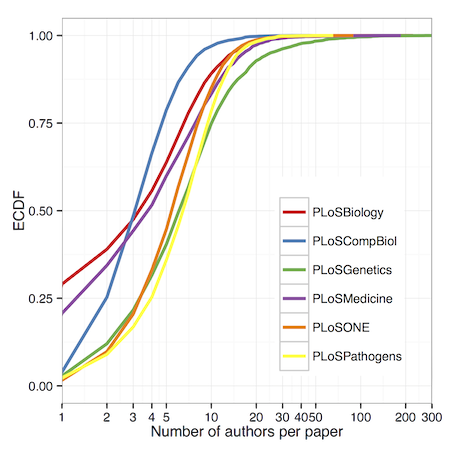

<!-- Limit image width and height -->
<style type='text/css'>

.rChart {
    display: block;
    margin-left: auto;
    margin-right: auto;
    width: 500px;
    height: 500px !important;
}

img {
    max-height: 540px;
    max-width: 964px;
}
body {
  /* margin-top: 40px; */
}
ol.linenums {
  margin-left: 0px;
}
#features p {
  font-size: 14px;
  line-height: 21px;
  color: #777777;
}
#solo p {
  text-align:center;
  font-size:xx-large;
  /* font-weight:bolder; */
  margin-top:25%;
  color:#777777;
}

.title-slide {
  background-color: #FEFEFE;
}

#bigwriting {
  font-size:x-large;
}

</style>

<!-- Center image on slide -->
<script src="http://ajax.aspnetcdn.com/ajax/jQuery/jquery-1.7.min.js"></script>
<script src='http://d3js.org/d3.v3.min.js' type='text/javascript'></script>
<!-- <script src='http://dimplejs.org/dist/dimple.v2.1.0.min.js' type='text/javascript'></script> -->

<script type='text/javascript'>
$(function() {
    $("p:has(img)").addClass('centered');
});
</script>

## I'm going to talk about...

<br />

A couple of examples of R analyses I've done for fun:

  1. Author inflation

  2. Overrated films

<br />

And along the way:

* Fitting R into web frameworks with rCharts and slidify

* Tips for would be "data scientists" / data bloggers

* Getting people to actually read your stuff

--- #solo 

Example 1: Author inflation

--- bg:black

<article class="flexbox vcenter">

</article>

---

## Starting point

<ul class="build fade">

<li> Good question </li>

<li> No real answers, speculation </li>

<li> Easy to test!!</li>

</ul>

<aside class="note">
<section>
<ul>
<li>See this amazing link: <a href="http://www.google.com">link</a>.</li>
</ul>
<p><b>Remember to say this tag line!</b></p>
</section>
</aside>

--- 

## Getting some data

<br />


<div style="width: 50%; margin-left: auto; margin-right: auto; margin-top: 10%" class="fragment">

</div>

*** pnotes

Here I used a package built by ROpenSci — fell I should plug them as they're doing great work,
hackathons, reproducibility, workshops etc.

---

## Code

```{r eval=F}

searchplos(
  # Query: publication date in 2012
  q  = 'publication_date:[2012-01-01T00:00:00Z TO 2012-12-31T23:59:59Z]', 
 
  # Fields to return: id (doi) and author list
  fl = "id,author", 
 
  # Filter: only actual articles in journal PLOS ONE
  fq = list("doc_type:full",
            "cross_published_journal_key:PLoSONE"), 
 
  # 500 results (max 1000 per query)
  start=0, limit=500, sleep=6)
  
```

<aside class="note">
<section>
<ul>
<li>Point I wanted to make #1</li>
<li>Point I wanted to make #2</li>
<li>Point I wanted to make #3</li>
<li>Example <a href="#">link</a> in notes.</li>
</ul>
<p><b>Remember to say this tag line!</b></p>
</section>
</aside>

--- &rightcol

## Results

*** =left

<br />


*** =right

<br />



--- bg:black

## 270 authors...


---

## Evidence for author inflation


--- &leftcol

## High impact == high inflation ?

*** =left


*** =right

<br />

<u>TODO</u>

> * expand to entire NLM Medline / Pubmed records (>22 mill)

> * Try to get at "good inflation vs. bad inflation"

>   * Relative growth of acknowledgements? (PMC)

--- #solo 

Example 2: Overrated movies

---

## Starting point

<br />

* Everyone relates to concept of "over/underrated" — but it's inherently subjective

* Maybe a way to quantify this (with, e.g. films) could be:

<br />

> * <b>Critic ratings</b> — subjective ratings

> * <b>Audience ratings</b> — "objective truth" (crowd-sourced, many wrongs principle)

>   * (Wrong way round? Up to you... ) <br /><br />

> * So given this definition of "overrated": <br /><p style="font-size: 1.3em; text-align: center;"><b>Q:</b> What are the most (over|under)rated films?</p>


--- 


They have a REST API! 

```{r eval=F}

library("RCurl")
library("jsonlite")

api.key <- "somelongAPIkey"
rt <- getURI(paste0("http://api.rottentomatoes.com/api/public/v1.0/",
                    "lists/dvds/top_rentals.json?apikey=", api.key, "&limit=50"))

rt <- fromJSON(rt)

title <- rt$movies$title
critics <- rt$movies$ratings$critics_score
audience <- rt$movies$ratings$audience_score
```

--- 

<p style="font-color: #ffa775; font-size: 1.4em; text-align: center;">This is easy, why hasn't someone done it before...</p>

<br />


<br />

<div style="text-align: center;"><h2>!!!</h2></div>

--- 

## Hacky solution

<br />

> 1. Get largest starting list of films possible (Top rentals: <b>50</b>)

> 2. For each, retrieve "similar films" (max: <b>5</b>!)

> 3. Rinse, recurse

> 4. Enjoy the expontential growth...

--- &rightcol

## "Walled gardens"

*** =left

<br />

<br />


*** =right

<br />


---

## Results v1


---

<!--
<div id='chart12666f920d7f' class='rChart dimple'></div>
<script src="js/films.js"></script>
-->

<iframe width='100%' height='100%' src='http://blm.io/movie_embed.html' frameborder='0' scrolling="no"></iframe>

--- &colscust

## R background

*** =left

<br />

<h3>"Hadley"-verse</h3>

* Robust, powerful libraries with strong theoretical underpinnings:

  * <code>ggplot2</code> :: Grammar of graphics (Leland Wilkinson)

  * <code>dplyr</code> :: Grammar of tidying data

*** =right

<br />

<ul style="list-style-type: none !important; list-style: none !important;" class="build">

<li style="list-style: none !important;"><h3>"Ramnath"-verse</h3></li>

<li style="list-style: none !important;">Neat hacks that get R talking to various javascript libraries:</li>

<li style="list-style: none !important;">&nbsp;&nbsp;<code>rCharts</code> :: js plots from lattice-like syntax</li>

<li style="list-style: none !important;">&nbsp;&nbsp;<code>slidify</code> :: HTML/JS/CSS presentations from RMarkdown</li>

</ul>

--- &colscust

## Interactive charts

*** =left

How we will be doing it:
<br />
<p style="text-align: center;">
R
<br /><br />
&#x25BC;
<br /><br />
ggvis (Rstudio)
<br /><br />
&#x25BC;
<br /><br />
Vega
<br /><br />
&#x25BC;
<br /><br />
D3.js
</p>

*** =right

But currently:
<br />
<p style="text-align: center;">
R
<br /><br />
&#x25BC;
<br /><br />
<b>rCharts</b>
<br /><br />
&#x25BC;
<br /><br />
[ dimple.js, highcharts, NVD3, ... ]
<br /><br />
&#x25BC;
<br /><br />
D3.js
</p>

---

## D3.js

Handles data mapping (often JSON) + acts like jQuery for SVGs.

Very powerful but low-level — basic graphs use the same few elements so 
no need to reinvent wheel for these.

<div id="collision" style="width: 100%; height: 50%; display: block;"></div>
<script src="js/collision.js"></script>

---

<p style="text-align:center; font-size:xx-large; margin-top:20%">
Thanks for your attention
</p>
<br />
<div style="width: 60%; height: auto; margin: 5% auto;">
<p>
People who've helped me out or I've stolen code from:
</p>
<p style="font-size:.8em; text-align:center">
<b>@ramnath_vaidya</b> (rCharts, slidify), @hadley_wickham (dplyr, ggplot2, devtools), 
@kwbroman, @timelyportfolio, <b>StackOverflow</b>,
@mbostock (d3.js), @jkiernander (dimple.js)
</p>
</div>

<div style="float:left; margin-top:1%"> <p style="font-size:small">HTML5 presentation written in <code>RMarkdown</code> using <code>library("slidify")</code>.</p></div>

```{r eval=F, echo=F}
library("slidify")
library("slidifyLibraries")
slidify("~/Presentations/Evogen_Nov12_2014/index.Rmd")
```
